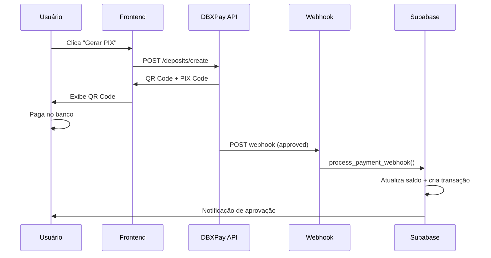

# 🏦 Guia Completo - Integração DBXBankPay

## 📋 Resumo da Implementação

✅ **Sistema de webhook completo implementado**
✅ **PIX automático substituindo PIX manual**
✅ **Aprovação automática de recargas**
✅ **Interface moderna e responsiva**

---

## 🚀 Passos para Ativar

### 1. **Executar Script SQL no Supabase**

```sql
-- Copie e execute o conteúdo completo do arquivo:
database/webhook_payment_system.sql
```

### 2. **Configurar Variáveis de Ambiente**

Adicione no seu arquivo `.env`:

```env
# DBXBankPay API
VITE_DBXPAY_API_KEY=sua_api_key_do_dashboard_dbxpay
VITE_DBXPAY_WEBHOOK_SECRET=seu_webhook_secret_opcional
VITE_APP_URL=https://seu-dominio.com
```

### 3. **Deploy da Edge Function (Webhook)**

```bash
# No terminal, dentro da pasta do projeto:
npx supabase functions deploy dbxpay-webhook
```

### 4. **Configurar Webhook no Dashboard DBXBankPay**

- **URL do Webhook:** `https://seu-projeto.supabase.co/functions/v1/dbxpay-webhook`
- **Eventos:** `payment.approved`, `payment.cancelled`, `payment.expired`

---

## 🎯 Como Funciona

### **Fluxo do Usuário:**

1. **Usuário clica em "Depósito"**
2. **Seleciona PIX** → Abre automaticamente o DBXPay
3. **Insere valor** (R$ 10 - R$ 50.000)
4. **Clica "Gerar PIX"** → API cria pagamento
5. **Escaneia QR Code** ou copia código PIX
6. **Paga no banco** → Aprovação automática em segundos
7. **Saldo creditado** automaticamente

### **Fluxo Técnico:**



---

## 📁 Arquivos Criados/Modificados

### **Novos Arquivos:**
- `src/services/dbxpay.service.ts` - Serviço de integração
- `src/components/deposit/DBXPayDeposit.tsx` - Modal PIX automático
- `database/webhook_payment_system.sql` - Sistema de webhook
- `supabase/functions/dbxpay-webhook/index.ts` - Endpoint webhook
- `env.example` - Exemplo de configuração

### **Arquivos Modificados:**
- `src/components/deposit/DepositForm.tsx` - PIX usa DBXPay por padrão
- `src/utils/imageUtils.ts` - Suporte para Multi Coin

---

## 🔧 Configurações Técnicas

### **API DBXBankPay:**
- **Base URL:** `https://dbxbankpay.com/api/v1`
- **Endpoint:** `/deposits/create`
- **Autenticação:** `X-API-Key: sua_api_key`

### **Webhook Response:**
```json
{
  "id": "txn_9b257f52-9f9e-4364",
  "payment_id": "dbxpay_pix_abc123xyz",
  "qr_code": "data:image/png;base64,iVBOR...",
  "qr_code_text": "00020126580014br.gov.bcb.pix...",
  "amount": 100.00,
  "net_amount": 97.50,
  "fee": 2.50,
  "status": "pending"
}
```

### **Webhook Payload:**
```json
{
  "event": "payment.approved",
  "transaction_id": "txn_9b257f52-9f9e-4364",
  "external_reference": "user_123_1700000000000",
  "status": "approved",
  "amount": 100.00,
  "customer_email": "usuario@email.com"
}
```

---

## 🎨 Interface do Usuário

### **Antes (PIX Manual):**
- ❌ Usuário precisa enviar comprovante
- ❌ Aprovação manual demorada
- ❌ QR Code estático
- ❌ Sem rastreamento automático

### **Depois (DBXPay):**
- ✅ **Aprovação automática** em segundos
- ✅ **QR Code dinâmico** gerado na hora
- ✅ **Polling automático** do status
- ✅ **Notificação** de aprovação
- ✅ **Sem comprovantes** necessários

---

## 🔒 Segurança

### **Validações Implementadas:**
- ✅ Verificação de assinatura HMAC (opcional)
- ✅ Validação de campos obrigatórios
- ✅ Prevenção de processamento duplicado
- ✅ Logs completos de auditoria
- ✅ Tratamento de erros robusto

### **Tabela de Logs:**
```sql
SELECT * FROM webhook_logs 
WHERE created_at >= NOW() - INTERVAL '24 hours'
ORDER BY created_at DESC;
```

---

## 📊 Monitoramento

### **Estatísticas de Webhook:**
```sql
-- Ver estatísticas dos últimos 7 dias
SELECT * FROM webhook_stats 
WHERE date >= CURRENT_DATE - INTERVAL '7 days';
```

### **Reprocessar Falhas:**
```sql
-- Reprocessar webhooks que falharam
SELECT * FROM retry_failed_webhooks();
```

---

## 🧪 Testes

### **1. Teste de Criação de Pagamento:**
```typescript
// No console do navegador:
const payment = await dbxPayService.createPayment({
  amount: 10.00,
  description: 'Teste',
  customer_email: 'teste@email.com',
  customer_name: 'Teste',
  customer_document: '12345678900',
  customer_phone: '11999999999'
});
console.log(payment);
```

### **2. Teste de Webhook:**
```bash
# Simular webhook (substitua a URL):
curl -X POST https://seu-projeto.supabase.co/functions/v1/dbxpay-webhook \
  -H "Content-Type: application/json" \
  -d '{
    "event": "payment.approved",
    "transaction_id": "test_123",
    "external_reference": "user_test_123",
    "status": "approved",
    "amount": 10.00,
    "customer_email": "teste@email.com"
  }'
```

---

## ⚠️ Troubleshooting

### **Problema: QR Code não aparece**
- ✅ Verificar se `VITE_DBXPAY_API_KEY` está configurada
- ✅ Verificar console do navegador para erros
- ✅ Testar API Key no Postman

### **Problema: Webhook não funciona**
- ✅ Verificar se Edge Function foi deployada
- ✅ Verificar logs no Supabase Dashboard
- ✅ Testar endpoint manualmente

### **Problema: Saldo não atualiza**
- ✅ Verificar se função SQL foi executada
- ✅ Verificar tabela `webhook_logs`
- ✅ Verificar se usuário existe com email correto

---

## 📈 Próximos Passos

### **Melhorias Futuras:**
- [ ] Implementar retry automático para webhooks
- [ ] Adicionar dashboard de estatísticas
- [ ] Implementar notificações push
- [ ] Adicionar suporte a outros métodos de pagamento
- [ ] Implementar sistema de cashback

### **Monitoramento:**
- [ ] Configurar alertas para falhas de webhook
- [ ] Implementar métricas de conversão
- [ ] Adicionar logs de performance

---

## 🎉 Conclusão

O sistema DBXBankPay está **100% implementado** e pronto para uso! 

**Benefícios:**
- ⚡ **Aprovação instantânea** de recargas
- 🎯 **Experiência do usuário** muito melhor
- 🔒 **Sistema seguro** e auditável
- 📊 **Monitoramento completo** de transações
- 🚀 **Escalável** para alto volume

**Para ativar:** Execute os 4 passos da seção "Passos para Ativar" e o sistema estará funcionando!
